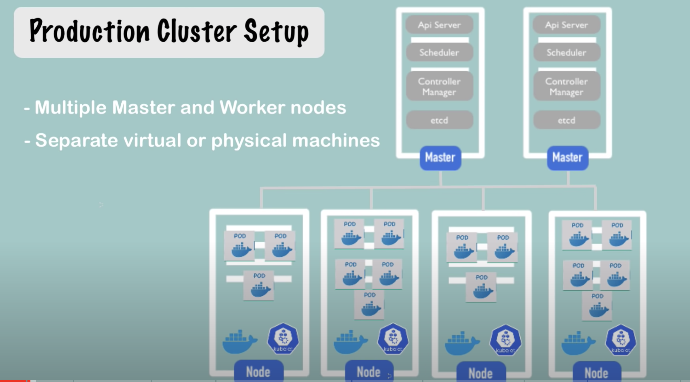

## What is Kubernetes
Kubernetes, often abbreviated as K8s, is an open-source container orchestration platform. It was originally developed by Google and is now maintained by the Cloud Native Computing Foundation (CNCF). Kubernetes provides a framework for automating the deployment, scaling, and management of containerized applications.

Containers are a lightweight way to package and run applications and their dependencies in an isolated environment. Kubernetes helps manage these containers at scale, making it easier to deploy and operate complex applications across various environments.

Key features of Kubernetes include:
1. Container Orchestration: Kubernetes automates the deployment, scaling, and management of containerized applications. It ensures that containers are running in the desired state, handling automatic scaling based on demand, and replacing failed containers.
2. Service Discovery and Load Balancing: Kubernetes enables service discovery among containers within a cluster. It also provides load balancing to distribute incoming network traffic across multiple instances of an application.
3. Automatic Rollouts and Rollbacks: Kubernetes allows you to update your application without downtime using rolling updates. If an update causes issues, you can easily roll back to the previous version.
4. Self-Healing: Kubernetes monitors the health of applications and containers. If a container fails, Kubernetes automatically replaces it to maintain desired state.
5. Storage Orchestration: Kubernetes provides a way to manage and attach storage to containers. This is crucial for applications that require persistent data.
6. Configuration Management: Kubernetes lets you manage configuration separately from application code, making it easier to apply changes to your application's environment.
7. Secrets and Configuration Management: Kubernetes enables the secure management of sensitive information such as passwords and API keys.
8. Horizontal Scaling: Kubernetes allows you to scale your applications horizontally by adding or removing instances of containers based on demand.
9. Multi-Cluster Deployment: Kubernetes supports multi-cluster deployments, enabling you to manage multiple clusters across different environments and regions.

Kubernetes uses a declarative approach to managing infrastructure, meaning you define the desired state of your application and Kubernetes handles the details of getting your application to that state.

## Docker and Kubernetes comparison 
Docker and Kubernetes are both important tools in the world of containerization and application deployment, but they serve different purposes and play different roles in the application lifecycle.

### Docker:
1. Containerization Platform: Docker is a platform that allows you to package applications and their dependencies into standardized units called containers. These containers are portable and consistent across different environments.
2. Creating Containers: Docker provides tools for creating, building, and managing container images. A container image is a lightweight, standalone executable software package that includes everything needed to run a piece of software, including the code, runtime, libraries, and system tools.
3. Development and Testing: Docker is commonly used by developers for creating development environments that closely mirror production. This helps in avoiding the "it works on my machine" problem and ensures consistent behavior across different environments.
4. Isolation: Docker containers provide a level of isolation between applications and their dependencies. Each container runs in its own isolated environment while sharing the same underlying OS kernel.
5. Performance Overhead: Docker containers have relatively low performance overhead because they share the host OS kernel and use resources more efficiently compared to traditional virtualization.

### Kubernetes:
1. Container Orchestration: Kubernetes is an orchestration platform designed to manage the deployment, scaling, and operation of containerized applications across clusters of hosts. It automates many aspects of application management.
2. Managing Containers: Kubernetes is focused on managing containers and their lifecycle, including deploying, scaling, updating, and maintaining the desired state of applications.
3. Scaling and Load Balancing: Kubernetes provides automated scaling and load balancing for containers based on user-defined rules and resource utilization.
4. Service Discovery: Kubernetes offers built-in service discovery and communication between containers, allowing them to communicate with each other seamlessly.
5. High Availability: Kubernetes supports automatic failover and rescheduling of containers in case of node failures or other issues, ensuring high availability of applications.
6. Complex Applications: Kubernetes is suitable for managing complex applications composed of multiple microservices and components. It simplifies the deployment and scaling of these applications.
7. Multi-Node Clusters: Kubernetes is designed to work with multi-node clusters, allowing applications to be distributed across multiple servers.

In summary, Docker provides a way to package and distribute applications as containers, while Kubernetes provides a platform for managing and orchestrating containerized applications at scale. Docker is more focused on creating and managing container images, while Kubernetes is focused on deploying and managing those containers across a cluster of machines. Often, Docker and Kubernetes are used together, where Docker containers are deployed and managed using Kubernetes for orchestration.

## Examples of how to define a cluster using Docker and Kubernetes.
### Docker:
In Docker, you can create a cluster of containers using Docker Compose. Docker Compose is a tool for defining and running multi-container Docker applications. Here's a simple example of defining a cluster using Docker Compose:

Let's say you have a web application that consists of two services: a frontend service and a backend service. You can define a `docker-compose.yml` file like this:

```yml
version: '3'
services:
  frontend:
    image: my-frontend-image
    ports:
      - "80:80"
  backend:
    image: my-backend-image
    ports:
      - "8080:8080"
```
In this example, you've defined a cluster with two services (`frontend` and `backend`). The image property specifies the Docker images used for each service, and the ports property maps container ports to host ports.

### Kubernetes:
In Kubernetes, you define a cluster by creating configuration files that describe the desired state of your applications and their components. Let's continue with the same example of a web application with frontend and backend services:

* Create a file named `frontend-deployment.yaml` for the frontend service:
```yml
apiVersion: apps/v1
kind: Deployment
metadata:
  name: frontend-deployment
spec:
  replicas: 3
  selector:
    matchLabels:
      app: frontend
  template:
    metadata:
      labels:
        app: frontend
    spec:
      containers:
        - name: frontend
          image: my-frontend-image
          ports:
            - containerPort: 80 
```
* Create a file named `backend-deployment.yaml` for the backend service:
```yml
apiVersion: apps/v1
kind: Deployment
metadata:
  name: backend-deployment
spec:
  replicas: 3
  selector:
    matchLabels:
      app: backend
  template:
    metadata:
      labels:
        app: backend
    spec:
      containers:
        - name: backend
          image: my-backend-image
          ports:
            - containerPort: 8080 
```
* Create a file named `cluster.yaml` to define a Kubernetes Service to expose the frontend:
```yml
apiVersion: v1
kind: Service
metadata:
  name: frontend-service
spec:
  selector:
    app: frontend
  ports:
    - protocol: TCP
      port: 80
      targetPort: 80
  type: LoadBalancer 
```
In this example, you've defined Kubernetes Deployments for both the frontend and backend services, specifying the desired number of replicas and the Docker images to use. Additionally, you've defined a Service to expose the frontend application externally.

These Kubernetes configuration files, when applied using the `kubectl` command-line tool, would create and manage the specified resources in a Kubernetes cluster.

## Kubernetes Components
Kubernetes is composed of several core components that work together to manage containerized applications within a cluster. These components provide various functionalities such as orchestration, scheduling, networking, storage, and more. Here are the key components of Kubernetes:
1. Control Plane Components:
   The control plane components manage the overall state and orchestration of the cluster.
   * API Server: Acts as the front-end for the Kubernetes control plane. It exposes the Kubernetes API, which is used by both internal components and external users to interact with the cluster.
   * etcd: A distributed key-value store that stores the configuration data of the cluster, including the desired state, configuration settings, and metadata.
   * Scheduler: Responsible for making scheduling decisions on which nodes to place newly created pods. It considers factors like resource requirements, affinity/anti-affinity rules, and more.
   * Controller Manager: Manages various controllers that monitor the state of the cluster and take corrective actions to ensure the desired state is maintained. Examples include the Replication Controller and the Node Controller.
   * Cloud Controller Manager: Interfaces with cloud providers to manage resources specific to that provider. Examples include managing load balancers, volumes, and virtual machines.

2. Node Components:
   These components run on each node (machine) in the cluster and manage the containers running on that node.
   * Kubelet: Ensures that containers are running in a Pod by interacting with the container runtime (e.g., Docker) and reporting the node's status to the control plane.
   * Kube Proxy: Maintains network rules on nodes, allowing network communication to be load-balanced across pods and services.
   * Container Runtime: The software responsible for running containers. Docker, containerd, and cri-o are commonly used container runtimes.

3. Pods:
   The smallest deployable units in Kubernetes, pods encapsulate one or more containers that share the same network namespace and storage. They often represent a single instance of an application.

4. Services:
   Services define a stable network endpoint for a set of pods, allowing external traffic to reach a group of containers. They provide load balancing and service discovery within the cluster.
5. Volume:
   Volumes provide a way to persist and share data among containers within a pod. They can be attached to pods and outlive the lifecycle of individual containers.
6. Namespaces:
   Namespaces provide a way to partition resources and isolate them within a cluster. They are used to create multiple virtual clusters within a physical cluster.
7. ConfigMaps and Secrets:
   ConfigMaps allow you to manage configuration data separately from your application code, while Secrets are used to store sensitive information securely, like passwords and API keys.
8. Ingress:
   An API object that manages external access to services within the cluster, providing features like load balancing, SSL termination, and path-based routing.
9. Network Policies:
   Define rules for communication between pods, controlling ingress and egress traffic within the cluster.
10. Persistent Volumes and Persistent Volume Claims:
    These resources allow you to manage storage and provide a way to dynamically provision storage resources for pods.

These components work together to provide the core functionality of Kubernetes, enabling the deployment, scaling, and management of containerized applications.

## namespace
In Kubernetes, a namespace is a virtual cluster within a physical cluster that allows you to logically partition and isolate resources. Namespaces provide a way to organize and segregate various objects (such as pods, services, deployments, and more) into separate groups. This helps manage and maintain multiple applications or environments within the same Kubernetes cluster.

Key points about namespaces:
1. Isolation: Namespaces provide a level of isolation between resources. Objects in one namespace are isolated from objects in other namespaces, meaning they have their own separate scope.
2. Resource Scoping: Each Kubernetes object belongs to exactly one namespace. If a namespace is not specified, the object is created in the default namespace by default.
3. Default Namespace: When you create Kubernetes resources without specifying a namespace, they are created in the default namespace.
4. Multi-Tenancy: Namespaces allow multiple teams or projects to use the same cluster without interfering with each other. Each team can work within its own namespace.
5. Organization: Namespaces provide a way to organize resources, making it easier to manage and locate them in a large cluster.
6. Resource Quotas and Limits: You can set resource quotas and limits at the namespace level, controlling the amount of CPU, memory, and other resources that objects within the namespace can use.
7. Namespace Labels and Annotations: Namespaces can be labeled and annotated, allowing you to add metadata to the namespace itself.
8. Namespace Networking: Some networking policies and configurations, such as Network Policies and Service Discovery, are applied at the namespace level.
9. System and Custom Namespaces: Kubernetes comes with several system namespaces (e.g., `kube-system`, `default`) that are used for cluster-level components. You can also create custom namespaces for your applications and services.
10. Switching Between Namespaces: You can use kubectl to switch between namespaces when working with resources. For example, `kubectl get pods -n <namespace-name>`.

Common use cases for namespaces include:
* Multi-Environment Deployments: You can create namespaces for development, testing, and production environments to isolate resources and avoid conflicts.
* Multi-Tenant Clusters: Different teams or projects can use their own namespaces, maintaining separation while sharing the same cluster.
* Resource Organization: Namespace-based organization helps keep resources organized and manageable.
* Resource Quotas: Assign specific resource quotas to different namespaces based on team or project requirements.

Remember that namespaces are a way to logically partition resources and provide isolation. They do not provide the same level of isolation as running separate clusters.

***[Kubernetes Architecture Explained](https://devopscube.com/kubernetes-architecture-explained/)***


### Control Plane
The control plane is responsible for container orchestration and maintaining the desired state of the cluster. It has the following components.

* kube-apiserver
* etcd
* kube-scheduler
* kube-controller-manager
* cloud-controller-manager

### Worker Node
The Worker nodes are responsible for running containerized applications. The worker Node has the following components.
* kubelet
* kube-proxy
* Container runtime


## Quick Notes:

### Cluster in Kubernetes
In Kubernetes, a cluster refers to a set of physical or virtual machines, known as nodes, that are grouped together to collectively manage containerized applications. A cluster provides a unified environment for deploying, scaling, and managing applications using Kubernetes' orchestration capabilities.

A Kubernetes cluster consists of two main components:
 * Control Plane: The control plane is responsible for managing and controlling the overall state of the cluster. It includes components like the API server, etcd, scheduler, and controller manager. These components work together to define the desired state of applications and ensure that the actual state matches that desired state.
 * Nodes: Nodes are the worker machines that run the containerized applications. Each node hosts one or more pods, which are the smallest deployable units in Kubernetes. Nodes are responsible for running containers, managing networking, and providing resources like CPU and memory to the applications.

Key characteristics of a Kubernetes cluster include:
 * Scalability: Clusters can scale both vertically (adding more resources to nodes) and horizontally (adding more nodes) to accommodate changing application workloads.
 * High Availability: Kubernetes supports high availability by distributing and replicating control plane components across multiple nodes. If one node fails, the control plane can continue to function.
 * Resource Allocation: The cluster ensures that resources like CPU, memory, and storage are efficiently allocated to the pods based on their resource requests and limits.
 * Load Balancing: Kubernetes provides built-in load balancing for services, allowing external traffic to be distributed among the pods of an application.
 * Health Monitoring and Self-Healing: Kubernetes continuously monitors the health of applications and nodes. If a pod or node becomes unhealthy, Kubernetes automatically takes corrective actions to restore the desired state.
 * Service Discovery: Kubernetes provides service discovery mechanisms that allow pods to discover and communicate with each other using consistent and reliable network addresses.

A Kubernetes cluster can run on various infrastructure providers, including public clouds like AWS, Google Cloud, Azure, or on-premises data centers. It abstracts the underlying infrastructure, allowing you to manage applications without needing to worry about the specifics of the infrastructure.

Creating and managing a Kubernetes cluster involves setting up the control plane components, configuring nodes, networking, and ensuring proper security practices. Many tools, both from Kubernetes directly and from third-party vendors, help simplify the process of deploying and managing clusters.

### Tools to manage kubernetes cluster:
There are several tools available to manage Kubernetes clusters, each offering different levels of abstraction, features, and functionalities. Here are some popular tools for managing Kubernetes clusters:

* Kubectl: Kubectl is the official command-line tool for interacting with Kubernetes clusters. It allows you to create, manage, and troubleshoot resources within your cluster using commands and configuration files.
* Kubeconfig: Kubeconfig is a configuration file that defines how kubectl interacts with a Kubernetes cluster. It contains information about the cluster, user credentials, and context settings.
* Kops: Kops (Kubernetes Operations) is a command-line tool that helps you create, upgrade, and manage Kubernetes clusters on various cloud providers like AWS, GCP, and more. It automates the process of provisioning and managing the infrastructure.
* kubeadm: Kubeadm is a tool provided by Kubernetes to bootstrap and manage the lifecycle of a Kubernetes cluster. It simplifies the process of setting up a basic cluster on a single machine or a group of machines.
* Minikube: Minikube is a tool that allows you to run a single-node Kubernetes cluster on your local machine. It's useful for development, testing, and learning Kubernetes without the need for a full-scale cluster.
* k3s: k3s is a lightweight Kubernetes distribution designed for edge computing and resource-constrained environments. It aims to simplify installation and management while still offering essential Kubernetes features.
* Rancher: Rancher is a platform that provides a management interface for Kubernetes clusters. It helps with cluster provisioning, deployment, monitoring, and scaling. Rancher can manage multiple clusters across different environments.
* OpenShift: OpenShift is a Kubernetes distribution developed by Red Hat. It provides additional features such as developer tools, integrated CI/CD pipelines, and enhanced security.
* GKE (Google Kubernetes Engine): GKE is a managed Kubernetes service offered by Google Cloud. It abstracts the infrastructure management and allows you to deploy and manage Kubernetes clusters easily.
* AKS (Azure Kubernetes Service): AKS is a managed Kubernetes service provided by Microsoft Azure. It simplifies cluster deployment, management, and scaling on the Azure cloud platform.
* EKS (Elastic Kubernetes Service): EKS is Amazon's managed Kubernetes service. It provides a way to deploy and manage Kubernetes clusters on AWS infrastructure.

These tools offer various levels of abstraction and features to make it easier to create, manage, and operate Kubernetes clusters based on your requirements and expertise. The choice of tool depends on factors such as your deployment environment, use case, familiarity with Kubernetes, and desired level of control.

### Nodes is Kubernetes
In Kubernetes, a node refers to a physical or virtual machine that is part of a Kubernetes cluster. Nodes are the foundational computing resources where containers are deployed and run. Each node contributes CPU, memory, storage, and networking capabilities to the cluster, making it possible to run and manage containerized applications.

Key points about nodes in Kubernetes:
* Worker Machines: Nodes are worker machines that carry out the actual tasks of running containers and executing applications. They are where the containers and pods are deployed.
* Kubelet: Each node runs a component called the Kubelet, which is responsible for ensuring that containers within pods are running in their expected state. Kubelet interacts with the control plane to receive instructions about what pods should be running on the node.
* Container Runtime: The actual containers within the pods are managed by a container runtime, such as Docker, containerd, or cri-o. The runtime is responsible for creating, starting, stopping, and deleting containers.
* Kube Proxy: Nodes also run the Kube Proxy, which manages networking rules and routing traffic between pods, services, and the external world.
* Resource Management: Nodes have finite computing resources, including CPU and memory. Kubernetes manages resource allocation and ensures that pods receive the resources they request while not overloading the node.
* Taints and Tolerations: Nodes can be "tainted" to prevent certain pods from being scheduled on them. Pods can use "tolerations" to express their willingness to be scheduled on tainted nodes.
* Labels and Selectors: Nodes can be labeled with key-value pairs to categorize them (e.g., environment=production). Selectors are used to filter and match nodes based on these labels.
* Affinity and Anti-Affinity: Nodes can be selected based on their characteristics using affinity rules. Anti-affinity rules ensure that certain pods avoid being placed on the same node.
* Monitoring and Health Checking: Kubernetes continuously monitors the health of nodes and their resources. If a node becomes unhealthy, pods running on that node can be rescheduled to other healthy nodes.
* High Availability: Kubernetes clusters are designed to ensure high availability of applications. The control plane components can be distributed across multiple nodes, and applications can be scheduled on multiple nodes to prevent single points of failure.
* Nodes collectively form the computational foundation of a Kubernetes cluster, and the orchestration and management capabilities of Kubernetes ensure that the workloads are distributed and managed efficiently across these nodes.

## Compare clusters and nodes in the context of Kubernetes:
### Cluster:
* Definition: A Kubernetes cluster is a collection of physical or virtual machines (nodes) that work together to run containerized applications and provide orchestration and management capabilities.
* Purpose: The cluster is the entire environment where Kubernetes manages and orchestrates containerized applications. It includes the control plane components and the worker nodes.
* Components: A cluster consists of multiple components, including the control plane components (API server, etcd, scheduler, controller manager) and the worker nodes.
* Control Plane: The control plane manages the overall state of the cluster, defines the desired state of applications, and ensures that the actual state matches the desired state.
* Management: Clusters are managed using various tools and utilities, such as kubectl (the Kubernetes command-line tool) or higher-level management platforms like Rancher, OpenShift, and cloud provider services like GKE, AKS, and EKS.
* Scalability: Clusters can be scaled horizontally by adding more nodes to accommodate increasing workloads.

### Node:
* Definition: A node is a physical or virtual machine within a Kubernetes cluster that runs containerized applications. It's a worker machine responsible for executing the tasks assigned by the control plane.
* Purpose: Nodes provide the computational resources needed to run containers and execute applications within pods. They host containers and are responsible for managing networking, storage, and resource allocation.
* Components: Each node includes the Kubelet (responsible for pod management), a container runtime (e.g., Docker), and the Kube Proxy (networking component).
* Resource Management: Nodes allocate resources like CPU and memory to pods based on their resource requirements and limits.
* Taints and Tolerations: Nodes can be "tainted" to prevent certain pods from being scheduled on them. Pods can use "tolerations" to express their willingness to be scheduled on tainted nodes.
* Affinity and Anti-Affinity: Nodes can be selected based on their characteristics using affinity rules. Anti-affinity rules ensure that certain pods avoid being placed on the same node.
* Health Monitoring: Nodes are continuously monitored, and if a node becomes unhealthy, Kubernetes can reschedule pods to other healthy nodes.
* High Availability: Nodes can be distributed across multiple physical hosts to ensure high availability of applications. If a node fails, pods can be rescheduled on other nodes.

In summary, a Kubernetes cluster encompasses the entire environment, including control plane components and worker nodes, while nodes are individual machines within the cluster that host and manage the execution of containerized applications.

## Pod in Kubernetes 
In Kubernetes, a pod is the smallest deployable unit and the basic building block for running containerized applications. A pod represents a single instance of a running process in a cluster, which may consist of one or more containers that share the same network and storage resources. Pods are used to group tightly coupled containers that need to work together.

Here are some key points about pods in Kubernetes:
1. Container Co-location: A pod can contain one or more containers that are co-located on the same host and share the same network namespace. This allows the containers within the same pod to communicate with each other using localhost.
2. Shared Storage and Networking: Containers within a pod share the same storage volumes, IP address, and port space. This enables them to easily communicate and share data.
3. Atomic Unit: Kubernetes treats a pod as an atomic unit, meaning that all containers within the same pod are scheduled and managed together.
4. Pod Lifecycle: Pods have their own lifecycle, including creation, startup, running, and termination. When a pod is created, the containers within it are started concurrently.
5. Use Cases: Pods are commonly used for applications where containers need to work together closely, such as a web server paired with a sidecar for logging or monitoring.
6. Single IP Address: A pod is assigned a single IP address, and all containers within the pod share this IP. This makes it easier to route network traffic to the correct containers.
7. Data Sharing: Containers within the same pod can share the same storage volumes, making it convenient for applications that need to share data or communicate through files.
8. Anti-Pattern for Long-Lived Services: While pods are suitable for closely related containers, using pods for long-lived services is generally not recommended. Services should be managed by higher-level abstractions like Deployments or StatefulSets.

When deploying applications in Kubernetes, you often define and manage higher-level abstractions like Deployments, which manage the lifecycle of pods. Deployments allow you to scale, update, and roll back applications easily, abstracting away the complexity of managing individual pods.

In summary, a pod is a logical grouping of one or more containers that share the same network and storage resources and are scheduled and managed together as a single unit within a Kubernetes cluster.

## Compare nodes and pods in Kubernetes:
### Nodes:
* Definition: A node is a physical or virtual machine within a Kubernetes cluster that provides the computational resources needed to run containerized applications.
* Purpose: Nodes serve as the worker machines that execute tasks assigned by the control plane. They host containers and manage the execution environment for pods.
* Components: Nodes consist of the Kubelet (pod management), a container runtime (e.g., Docker), and Kube Proxy (networking component).
* Resource Allocation: Nodes allocate resources like CPU, memory, and storage to pods based on their resource requirements and limits.
* Taints and Tolerations: Nodes can be "tainted" to prevent certain pods from being scheduled on them. Pods can use "tolerations" to express their willingness to be scheduled on tainted nodes.
* Affinity and Anti-Affinity: Nodes can be selected based on their characteristics using affinity rules. Anti-affinity rules ensure that certain pods avoid being placed on the same node.
* Monitoring and Health: Nodes are continuously monitored. If a node becomes unhealthy, Kubernetes can reschedule pods to other healthy nodes.
* High Availability: Nodes can be distributed across multiple physical hosts to ensure high availability. If a node fails, pods can be rescheduled on other nodes.

### Pods:
* Definition: A pod is the smallest deployable unit in Kubernetes, representing one or more tightly coupled containers that share the same network and storage resources.
* Purpose: Pods group containers that need to work closely together. They represent a single instance of a running process within the cluster.
* Co-located Containers: Containers within the same pod are co-located on the same node and share the same network namespace, allowing them to communicate using localhost.
* Shared Storage and Networking: Containers within a pod share the same storage volumes, IP address, and port space. This enables easy communication and data sharing.
* Atomic Unit: Kubernetes treats a pod as an atomic unit, scheduling and managing all containers within the pod together.
* Single IP Address: A pod is assigned a single IP address, and all containers within the pod share this IP. This simplifies network routing.
* Data Sharing: Containers within the same pod can share storage volumes, which is useful for sharing data between containers.

In summary, nodes are the computational resources within a cluster that execute tasks and host containers, while pods are the basic deployable units consisting of tightly coupled containers that share networking and storage resources. Pods are scheduled and managed on nodes to run containerized applications.

## Container in Kubernetes
In Kubernetes, a container refers to a lightweight, standalone, and executable software package that includes everything needed to run a piece of software, including the code, runtime, system tools, system libraries, and settings. Containers provide a consistent and isolated environment for running applications across different environments, ensuring that the application behaves the same regardless of the underlying infrastructure.

Key points about containers in Kubernetes:

* Isolation: Containers provide process and file system isolation, allowing multiple containers to run on the same host without interfering with each other.
* Consistency: Containers encapsulate the application and its dependencies, making it consistent and portable across different environments, from development to production.
* Efficiency: Containers share the host's operating system kernel, which reduces the overhead compared to traditional virtualization.
* Images: Containers are created from container images, which are read-only templates containing the necessary files, libraries, and configurations to run the application. Images are stored in registries like Docker Hub or a private container registry.
* Docker: Docker is a popular platform for creating, building, and managing container images. It provides tools to package applications and their dependencies into container images.
* Container Runtimes: Container runtimes (like Docker, containerd, and cri-o) are responsible for running containers. They manage the process lifecycle, networking, and file system isolation.
* Orchestration: Kubernetes orchestrates the deployment, scaling, and management of containers across a cluster of machines. It schedules containers to run on appropriate nodes and ensures that the desired state of applications is maintained.
* Pods: In Kubernetes, containers are typically deployed within pods. A pod can contain one or more containers that share the same network namespace and storage volumes.
* Microservices: Containers are often used to implement microservices architecture, where applications are broken down into smaller, independently deployable units.
* Deployment and Scaling: Containers make it easier to deploy and scale applications. Kubernetes can automatically scale the number of containers based on demand.

Containers have revolutionized the way applications are developed, deployed, and managed, enabling efficient use of resources, consistent deployment practices, and faster application delivery. In Kubernetes, containers are the primary units of execution for deploying applications within pods, and they play a fundamental role in modern cloud-native application development.

## The number of containers per pod
In a microservices-based architecture on Kubernetes, determining how many containers should run within a single pod involves considering various factors to ensure optimal resource utilization, maintainability, and efficient management. The number of containers per pod is an important decision that affects deployment, scaling, resource sharing, and overall system complexity. Here are some guidelines to help you make this decision:
* Single Responsibility Principle: Follow the single responsibility principle of microservices. Each container within a pod should have a clear and distinct responsibility related to the application's functionality. This can lead to better maintainability and scalability.
* Resource Requirements: Evaluate the resource requirements (CPU, memory, storage) of each container. Containers with similar resource needs can be co-located within the same pod to efficiently utilize resources.
* Communication and Coupling: Consider the communication and coupling between containers. If containers need to communicate frequently and share data, it might make sense to colocate them in the same pod. If containers are loosely coupled and communicate through APIs, they can be in separate pods.
* Scaling Behavior: Understand how each service scales. If two services need to scale independently, it might be better to separate them into different pods. If they scale together, colocating them can simplify scaling and reduce overhead.
* Stateful vs. Stateless: Containers that require stateful operations (e.g., databases) might be better off in separate pods to ensure data integrity and avoid resource contention.
* Container Size: Consider the size of the containers. If a container is significantly larger than others, it might affect scheduling and resource allocation within the pod.
* Resource Sharing: Containers in the same pod share the same network namespace and storage volumes. If containers need to share data frequently, placing them in the same pod can simplify data exchange.
* Failure Isolation: Consider the impact of failures. Placing closely related containers in the same pod can help contain failures and mitigate their impact.
* Logging and Monitoring: If containers generate different types of logs or need separate monitoring, placing them in separate pods can facilitate logging and monitoring practices.
* Service Mesh: In more complex setups, consider using a service mesh like Istio to handle service-to-service communication, which might influence your decision on how to structure pods.
* Deployability: Consider how easy it is to deploy, update, and manage each container. If they share the same deployment cycle, they might be suitable for colocating.

Remember that Kubernetes provides flexibility, so you can always adjust and optimize your architecture based on monitoring, testing, and real-world usage. Additionally, tools like Kubernetes StatefulSets and Deployments can help manage pods and their scaling behavior, making it easier to adapt your architecture as needed.

## Example scenarios
let's explore some real-life scenarios where you might choose to place multiple containers within the same pod, as well as situations where you'd opt for different pods for each container:
### Multiple Containers in the Same Pod:
* Application with Sidecar: An example of colocating containers in the same pod is an application with a sidecar container responsible for logging, monitoring, or authentication. The main application container and the sidecar container share the same network namespace and can communicate efficiently.
* Data Processing Pipeline: In a data processing pipeline, multiple containers might be colocated in the same pod to handle various steps of data processing. For instance, you might have a container for data ingestion, one for transformation, and another for storing the processed data.
* Proxy and Service: A proxy container and a main application container can be colocated. The proxy container handles routing and load balancing while the application container focuses solely on business logic.
* Helper or Init Containers: Init containers that run before the main application container can be colocated. These init containers prepare data, setup configurations, or perform other initialization tasks.

### Different Pods for Each Container:
* Microservices: In a microservices architecture, each service is typically deployed in a separate pod to ensure loose coupling and independent scalability.
* Stateful Services: Stateful services like databases are often deployed in separate pods to ensure data integrity, isolation, and reliability. Each pod might have a single container for the database software.
* Decoupled Services: If services need to scale independently and have minimal interaction, they are often better suited to be deployed in separate pods. This allows better resource allocation and isolation.
* Separate Services: Different services with distinct responsibilities, such as a user authentication service and a product recommendation service, are generally deployed in separate pods to maintain modularity.
* Polyglot Architecture: If different services are built using different programming languages or frameworks, they are often deployed in separate pods with the appropriate runtime environments.
* Scaling Requirements: Services that need different scaling behaviors might be deployed in separate pods. For instance, a front-end service might scale differently from a back-end data processing service.
* Micro Frontends: In micro frontend architecture, where user interfaces are split into smaller pieces, each piece can be a separate container in its own pod.

Remember, the decision of whether to colocate containers in the same pod or use separate pods depends on factors like communication patterns, resource requirements, scaling behavior, data sharing, and maintainability. Kubernetes provides the flexibility to make these decisions based on your application's needs.

## FAQ
### Can we run same container in one pod?
Yes, you can run multiple instances of the same container within the same pod in Kubernetes. This approach is often used for certain types of auto-scaling scenarios and workloads that require close coordination between instances of the same container. However, this practice is not the typical way to achieve auto-scaling in Kubernetes, as it doesn't fully leverage the benefits of Kubernetes' orchestration capabilities.

When running multiple instances of the same container within the same pod in Kubernetes, you need to carefully manage port numbers to ensure that there is no port conflict among the container instances. Each container instance requires a unique port to avoid conflicts and enable proper communication. Each instance of the container within the pod should be assigned a unique port number for any ports it exposes. This is necessary to prevent conflicts between the instances.

However, when it comes to auto-scaling, Kubernetes provides better mechanisms that involve creating and managing multiple pods rather than multiple instances of a container within a single pod:

1. ReplicaSets and Deployments: Kubernetes provides ReplicaSets and Deployments to manage the desired number of identical pods. These resources handle auto-scaling based on defined rules and maintain the desired state of pods, ensuring availability and distributing the load.
2. Horizontal Pod Autoscaling (HPA): HPA automatically scales the number of pods based on observed CPU utilization or custom metrics. It's a dynamic way to manage the number of pods, allowing you to efficiently use cluster resources.
3. StatefulSets: For stateful applications, where each instance has its own identity and requires unique storage, StatefulSets manage the deployment of pods with stable network identifiers and storage.
4. DaemonSets: If you need one instance of a container to run on each node in the cluster (e.g., for monitoring agents), DaemonSets are more suitable.

### What is worker node?
In Kubernetes, a worker node (also known as a minion or node) is a physical or virtual machine that forms part of the cluster and is responsible for running the containers and managing their execution. Worker nodes are an essential component of the Kubernetes architecture, and they collectively provide the computational resources needed to host and run containerized applications.

## Auto-scaling in Kubernetes:
Auto-scaling in Kubernetes involves two main aspects: scaling pods and scaling nodes. Let's explore when and how each of these scaling actions is required:
### Scaling Pods:
Scaling pods refers to adjusting the number of instances of a specific pod running within the cluster. This is achieved using mechanisms like ReplicaSets, Deployments, and Horizontal Pod Autoscaling (HPA).

Example: Consider a web application deployed using a Deployment resource. The application experiences increased traffic due to a marketing campaign. To handle the increased load, you configure Horizontal Pod Autoscaling (HPA) based on CPU utilization. As the CPU usage exceeds a certain threshold, HPA automatically adds more pod instances to the cluster, effectively scaling the application horizontally. Each new pod instance is added to distribute the load across multiple containers.

### Scaling Nodes:
Scaling nodes involves adjusting the number of worker nodes in the cluster. This is typically managed by infrastructure providers or Kubernetes tools that support cluster auto-scaling.

Example: Suppose you're running a Kubernetes cluster on a cloud provider like Amazon Web Services (AWS) using their managed Kubernetes service (EKS). As your application's workload increases, the existing worker nodes might start reaching their resource limits. To ensure optimal performance, the cloud provider's auto-scaling group can automatically add new worker nodes to the cluster. These new nodes provide additional resources to accommodate the increased workload. As the load decreases, the auto-scaling group can also remove unnecessary nodes to save resources.

In summary, here's a comparison of when to scale pods and when to scale nodes:

### Scale Pods:
* When the demand for your application's services increases or decreases.
* To distribute the load among multiple instances of the same pod.
* To horizontally scale your application and handle increased traffic.
* Achieved through mechanisms like ReplicaSets, Deployments, and HPA.

### Scale Nodes:
* When the cluster's overall resource capacity (CPU, memory) is nearing its limits.
* To add or remove nodes in the cluster based on resource demand.
* Managed by cloud providers or cluster management tools.
* Ensures sufficient resources are available for the cluster and its workloads.

Both pod scaling and node scaling are important strategies to ensure that your applications run efficiently and reliably in a Kubernetes environment, adapting to changes in workload and resource demands.




