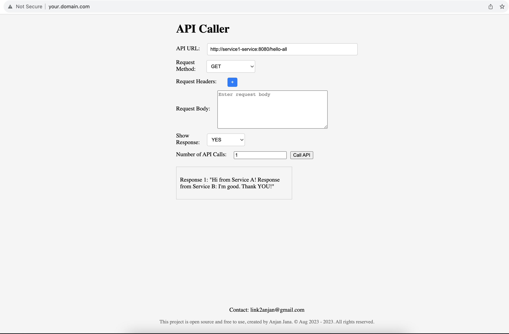

# Google Kubernetes Engine
## Install Google Cloud CLI on macOS
```markdown
brew install --cask google-cloud-sdk
```
link [Install CLI](https://cloud.google.com/sdk/docs/install)

### Initialize the CLI:
After installation, open your terminal and run the following command to initialize the Google Cloud CLI:
```markdown
gcloud init
```
* Sign in with your Google Cloud account when prompted in your web browser.
* Follow the prompts to configure your settings, including setting your default project and region.
* If you have multiple Google Cloud projects, you can choose which one to set as the default.

### Verify the Installation:
```markdown
gcloud --version
gcloud projects list
```

* Use the `gcloud config` command to set the active project. Replace `[PROJECT_ID]` with the project ID of the project you want to select:
```markdown
gcloud config set project [PROJECT_ID]
```
```markdown
gcloud config set project my-api-caller
```
To confirm that the active project has been set correctly, you can run the following command to display the active configuration:
```markdown
gcloud config list
```

---
# Deploying Full-fledge application into Google Kubernetes Cluster
In this example, we will deploy a full-fledge application called "api-caller" (Previously demonstrated locally in Minikube) in Google Kubernetes Engine.

## Create Kubernetes Cluster
You can create a cluster using Google Cloud Console or using CLI. 

### Using CLI: 
You can create a GKE cluster using the gcloud command-line tool. Replace `<cluster-name>` with your preferred cluster name and choose the desired options for your cluster:
```markdown
gcloud container clusters create <cluster-name> \
  --num-nodes=<number-of-nodes> \
  --machine-type=<machine-type> \
  --zone=<zone>
```
* Example
````markdown
gcloud container clusters create my-gke-cluster \
  --num-nodes=3 \
  --machine-type=n1-standard-2 \
  --zone=us-central1-a
````
* Configure `kubectl`:
To interact with your GKE cluster, configure kubectl by running:
```markdown
gcloud container clusters get-credentials <cluster-name> --zone=<zone>
```
Replace `<cluster-name>` and `<zone>` with your cluster's name and zone.
### Google Cloud's Autopilot mode for Kubernetes clusters
Google Cloud's Autopilot mode for Kubernetes clusters is a managed Kubernetes service that simplifies the management of Kubernetes clusters by abstracting away many of the underlying infrastructure and operational complexities. It is designed to make it easier for developers and operators to deploy and manage containerized applications without having to worry about the details of cluster provisioning, scaling, and maintenance.

```markdown
gcloud container --project "my-api-caller" clusters create-auto "my-api-caller" --region "asia-east1" --release-channel "regular" --network "projects/my-api-caller/global/networks/default" --subnetwork "projects/my-api-caller/regions/asia-east1/subnetworks/default" --cluster-ipv4-cidr "/17"
```
Here are some key features and characteristics of Google Kubernetes Engine (GKE) Autopilot mode:

* Automated Cluster Management: In Autopilot mode, Google Cloud takes care of cluster management tasks such as node provisioning, scaling, upgrades, and repairs. This eliminates the need for manual intervention in cluster operations.
* Nodeless Infrastructure: Unlike traditional GKE clusters where you manage a fleet of nodes (virtual machines), Autopilot mode operates without visible nodes. Instead, it uses a serverless, nodeless infrastructure. You define the desired resources for your workloads, and Google Cloud automatically provisions and manages the underlying infrastructure.
* Resource Management: You specify the resources (CPU and memory) you need for your containers, and GKE Autopilot mode automatically provisions the required infrastructure to meet those resource requirements.
* Self-Healing: Autopilot mode continuously monitors the health of your applications and automatically replaces or reschedules containers that fail or encounter issues, ensuring high availability.
* Managed Control Plane: Google Cloud manages the Kubernetes control plane, including the API server, etcd, and other components. This allows you to focus on deploying and managing your applications.
* Automatic Upgrades: Autopilot mode handles Kubernetes version upgrades, ensuring that your clusters are running secure and up-to-date versions of Kubernetes.
* Billing Based on Application Resources: Billing in Autopilot mode is based on the resources you allocate to your applications, making it cost-effective as you only pay for what you use.
* Horizontal Pod Autoscaling: Autopilot mode supports Horizontal Pod Autoscaling (HPA) to automatically adjust the number of replicas based on resource utilization and demand.
* Node Pools: While Autopilot clusters abstract away node management, you can still create traditional node pools with specific node configurations if needed.
* Container-Optimized OS: Autopilot mode uses Container-Optimized OS, a minimal and secure operating system optimized for running containers.

However, it's important to consider potential disadvantages or limitations when deciding between Autopilot mode and Standard mode.
* Limited Control: Autopilot abstracts away many of the details of cluster management, which means you have less control over the underlying infrastructure. This can be a limitation if you have specific requirements or customizations that cannot be achieved within the constraints of Autopilot.
* Cost: While Autopilot is designed to optimize resource utilization and cost efficiency, it may not be the most cost-effective option for all workloads. Billing in Autopilot is based on the resources allocated to your workloads, and this cost model may differ from traditional node-based billing.
* Networking and Security Constraints: Autopilot clusters have certain networking and security constraints due to the nodeless architecture. These constraints might limit your ability to configure network policies, use specific CNI plugins, or implement custom network configurations.
* Custom Nodes: If you have specific hardware requirements, use cases that require GPUs, or other specialized needs, Autopilot mode may not be the best fit. In such cases, Standard mode allows you to create custom node pools with the desired configurations.
* Node-Level Customizations: In Autopilot mode, you cannot make node-level customizations or install additional software on individual nodes. This can be a limitation if your workloads depend on specific node-level configurations.
* Network Performance: Autopilot clusters may have limitations on network performance compared to Standard mode, especially for applications with high network throughput or latency-sensitive requirements.
* Resource Limitations: Autopilot mode imposes resource limits on individual containers to ensure resource isolation and fair sharing. This may affect applications with specific resource requirements.

---
### Creating GKE cluster in auto-pilot mode
```markdown
gcloud container --project "my-api-caller" clusters create-auto "my-api-caller" --region "asia-east1" --release-channel "regular" --network "projects/my-api-caller/global/networks/default" --subnetwork "projects/my-api-caller/regions/asia-east1/subnetworks/default" --cluster-ipv4-cidr "/17"
```
### Set the Cluster Context:
Make sure that your `kubectl` command is configured to use the newly created cluster. You can do this by running:
```markdown
gcloud container clusters get-credentials my-gke-cluster --zone=your-preferred-zone
```
```markdown
gcloud container clusters get-credentials my-api-caller --region asia-east1
```
#### Troubleshooting:
```markdown
gcloud container clusters get-credentials my-api-caller --region asia-east1
Fetching cluster endpoint and auth data.
CRITICAL: ACTION REQUIRED: gke-gcloud-auth-plugin, which is needed for continued use of kubectl, was not found or is not executable. Install gke-gcloud-auth-plugin for use with kubectl by following https://cloud.google.com/blog/products/containers-kubernetes/kubectl-auth-changes-in-gke
kubeconfig entry generated for my-api-caller.
```
```markdown
gcloud components install gke-gcloud-auth-plugin
```
```markdown
gcloud container clusters get-credentials my-api-caller --region asia-east1

Fetching cluster endpoint and auth data.
kubeconfig entry generated for my-api-caller.
--
kubectl get pods                                                           
No resources found in default namespace.
```
### Creating namespace `namespace.yaml`
```yml
apiVersion: v1
kind: Namespace
metadata:
  name: my-app
```
```markdown
kubectl apply -f namespace.yaml 
--
namespace/my-app created
```
### Deploying front-end application `front-end.yml`
```yml
apiVersion: apps/v1
kind: Deployment
metadata:
  name: frontend-deployment
  namespace: my-app
spec:
  replicas: 1
  selector:
    matchLabels:
      app: frontend
  template:
    metadata:
      labels:
        app: frontend
    spec:
      containers:
        - name: frontend
          image: a1anjanjana/api-caller:latest
          ports:
            - containerPort: 3000
          resources:
            requests:
              memory: "128Mi"
              cpu: "100m"
            limits:
              memory: "256Mi"
              cpu: "200m"

---
apiVersion: v1
kind: Service
metadata:
  name: frontend-service
  namespace: my-app
spec:
  selector:
    app: frontend
  ports:
    - protocol: TCP
      port: 3000
      targetPort: 3000
  #type: NodePort
  type: LoadBalancer
```   
```markdown
kubectl apply -f front-end.yml 
--
Warning: autopilot-default-resources-mutator:Autopilot updated Deployment my-app/frontend-deployment: adjusted resources to meet requirements for containers [frontend] (see http://g.co/gke/autopilot-resources)
deployment.apps/frontend-deployment created
service/frontend-service created
```
### Verify deployment
```markdown
kubectl get pods -n my-app
--
NAME                                   READY   STATUS    RESTARTS   AGE
frontend-deployment-67c997cf6f-fsvqm   1/1     Running   0          51s
```
### Accessing front-end application
To access the application from outside the cluster using a LoadBalancer service, follow these steps:

```markdown
kubectl get svc frontend-service -n my-app

NAME               TYPE           CLUSTER-IP      EXTERNAL-IP     PORT(S)          AGE
frontend-service   LoadBalancer   34.118.229.90   35.234.38.189   3000:31976/TCP   3m53s
```
```markdown
curl http://35.234.38.189:3000
```

### Deploying service-1-config.yaml
```yaml
apiVersion: v1
kind: ConfigMap
metadata:
  name: service1-config
  namespace: my-app
data:
  SERVICE_2_API_URL: "http://service2-service:8080"
```
```markdown
kubectl apply -f service1-config.yml 
--
configmap/service1-config created
```
### Deploying service-1
```yaml
apiVersion: apps/v1
kind: Deployment
metadata:
  name: service1-deployment
  namespace: my-app
spec:
  replicas: 1
  selector:
    matchLabels:
      app: service1
  template:
    metadata:
      labels:
        app: service1
    spec:
      containers:
        - name: service1
          image: a1anjanjana/service-1:latest
          ports:
            - containerPort: 8080
          resources:
            requests:
              memory: "128Mi"
              cpu: "100m"
            limits:
              memory: "256Mi"
              cpu: "200m"
          envFrom:
            - configMapRef:
                name: service1-config  # Reference the ConfigMap here

---
apiVersion: v1
kind: Service
metadata:
  name: service1-service
  namespace: my-app
spec:
  selector:
    app: service1
  ports:
    - protocol: TCP
      port: 8080
      targetPort: 8080
```
```markdown
kubectl apply -f service1.yaml     
--
Warning: autopilot-default-resources-mutator:Autopilot updated Deployment my-app/service1-deployment: adjusted resources to meet requirements for containers [service1] (see http://g.co/gke/autopilot-resources)
deployment.apps/service1-deployment created
service/service1-service created
```
```markdown
kubectl get pods -n my-app                
NAME                                   READY   STATUS    RESTARTS   AGE
frontend-deployment-67c997cf6f-fsvqm   1/1     Running   0          55m
service1-deployment-ff9db4667-n6ghj    1/1     Running   0          55s
```
### Deploying service2
```yaml
apiVersion: apps/v1
kind: Deployment
metadata:
  name: service2-deployment
  namespace: my-app
spec:
  replicas: 1
  selector:
    matchLabels:
      app: service2
  template:
    metadata:
      labels:
        app: service2
    spec:
      containers:
        - name: service2
          image: a1anjanjana/service-2:latest
          ports:
            - containerPort: 8080
          resources:
            requests:
              memory: "128Mi"
              cpu: "100m"
            limits:
              memory: "256Mi"
              cpu: "200m"

---
apiVersion: v1
kind: Service
metadata:
  name: service2-service
  namespace: my-app
spec:
  selector:
    app: service2
  ports:
    - protocol: TCP
      port: 8080
      targetPort: 8080
```
```markdown
kubectl apply -f service2.yaml
Warning: autopilot-default-resources-mutator:Autopilot updated Deployment my-app/service2-deployment: adjusted resources to meet requirements for containers [service2] (see http://g.co/gke/autopilot-resources)
deployment.apps/service2-deployment created
service/service2-service created
```
### Deploying HPA
```yaml
apiVersion: autoscaling/v2
kind: HorizontalPodAutoscaler
metadata:
  name: backend-scaling-service1
  namespace: my-app
spec:
  scaleTargetRef:
    apiVersion: apps/v1
    kind: Deployment
    name: service1-deployment
  minReplicas: 1
  maxReplicas: 10
  metrics:
    - type: Resource
      resource:
        name: cpu
        target:
          type: Utilization
          averageUtilization: 50

---
apiVersion: autoscaling/v2
kind: HorizontalPodAutoscaler
metadata:
  name: backend-scaling-service2
  namespace: my-app
spec:
  scaleTargetRef:
    apiVersion: apps/v1
    kind: Deployment
    name: service2-deployment
  minReplicas: 1
  maxReplicas: 10
  metrics:
    - type: Resource
      resource:
        name: cpu
        target:
          type: Utilization
          averageUtilization: 50
    - type: Resource
      resource:
        name: memory
        target:
          type: Utilization
          averageUtilization: 50
```
```yaml
 kubectl apply -f backend-scaling.yaml 
horizontalpodautoscaler.autoscaling/backend-scaling-service1 created
horizontalpodautoscaler.autoscaling/backend-scaling-service2 created
```
### Deploying ingress
```yaml
apiVersion: networking.k8s.io/v1
kind: Ingress
metadata:
  name: frontend-ingress
  namespace: my-app
spec:
  rules:
    - host: your.domain.com  # Replace with your actual domain
      http:
        paths:
          - pathType: Prefix
            path: "/"
            backend:
              service:
                name: frontend-service
                port:
                  number: 3000
```
```markdown
kubectl apply -f ingress.yaml
```
After applying the Ingress resource, it may take some time for DNS changes to propagate across the internet. You can check the status of your Ingress resource using the following command:
```markdown
kubectl get ingress -n my-app

NAME               CLASS    HOSTS             ADDRESS         PORTS   AGE
frontend-ingress   <none>   your.domain.com   34.120.14.192   80      5m41s
```
** You can modify `host` file for testing
```markdown
cat /etc/hosts               
##
# Host Database
#
# localhost is used to configure the loopback interface
# when the system is booting.  Do not change this entry.
##
127.0.0.1	localhost
34.120.14.192   your.domain.com
```

### Access in browser 



