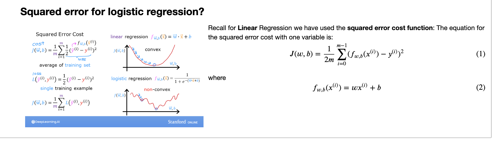
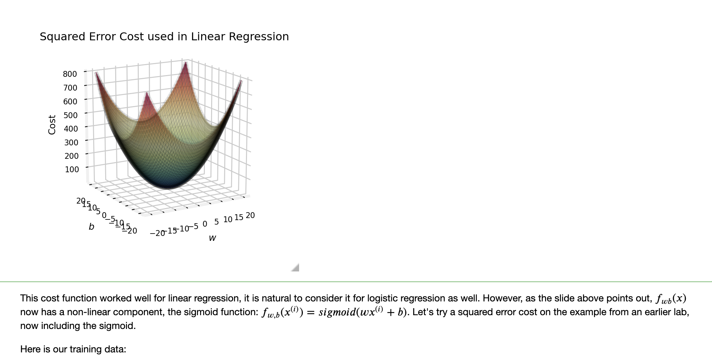
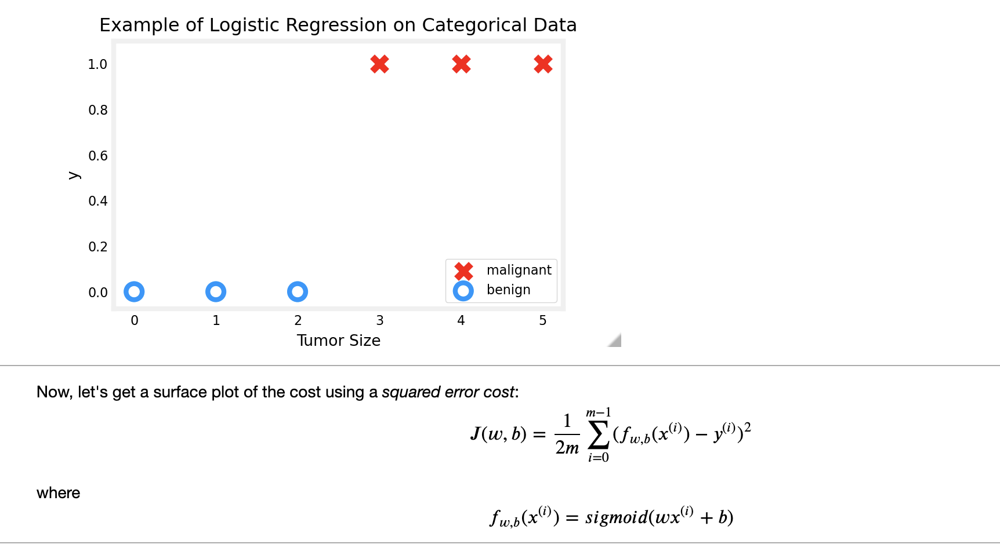
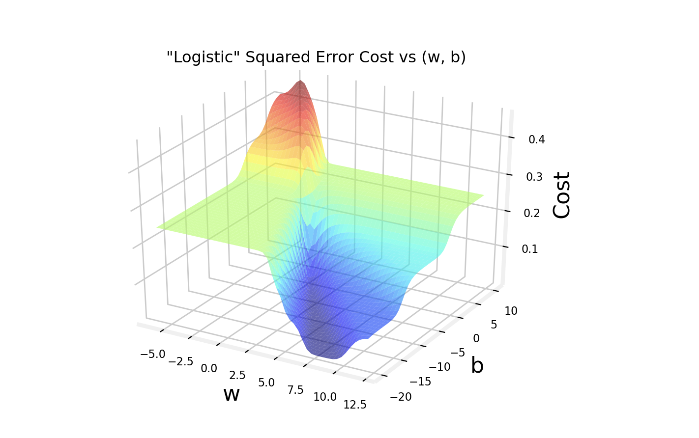
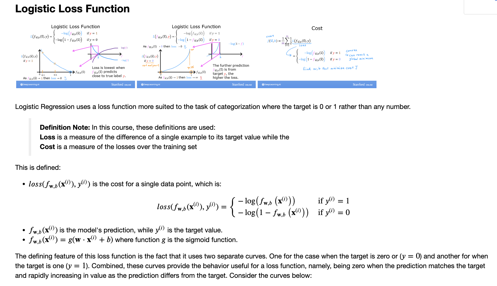
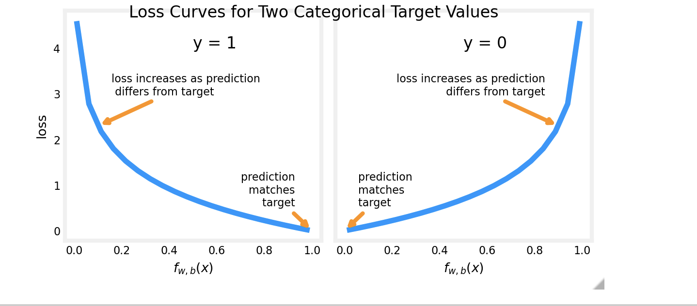
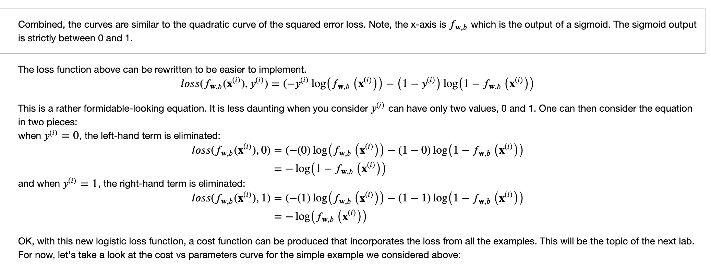
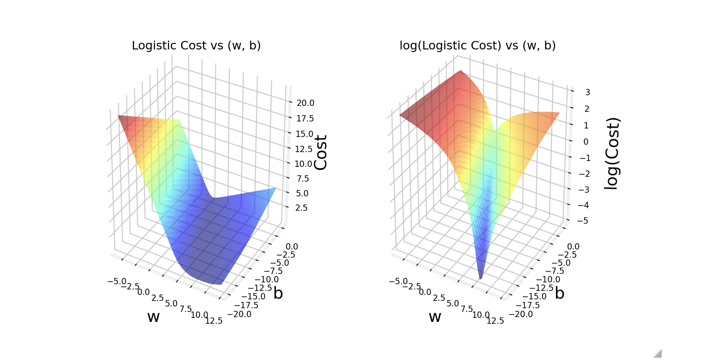

# Logistic Regression, Logistic Loss
In this ungraded lab, you will:
- explore the reason the squared error loss is not appropriate for logistic regression
- explore the logistic loss function

```python
import numpy as np
%matplotlib widget
import matplotlib.pyplot as plt
from plt_logistic_loss import  plt_logistic_cost, plt_two_logistic_loss_curves, plt_simple_example
from plt_logistic_loss import soup_bowl, plt_logistic_squared_error
plt.style.use('./deeplearning.mplstyle')
```

Recall, the squared error cost had the nice property that following the derivative of the cost leads to the minimum.
```python
soup_bowl()
```

```python
x_train = np.array([0., 1, 2, 3, 4, 5],dtype=np.longdouble)
y_train = np.array([0,  0, 0, 1, 1, 1],dtype=np.longdouble)
plt_simple_example(x_train, y_train)
```


```python
plt.close('all')
plt_logistic_squared_error(x_train,y_train)
plt.show()
```

While this produces a pretty interesting plot, the surface above not nearly as smooth as the 'soup bowl' from linear regression!

Logistic regression requires a cost function more suitable to its non-linear nature. This starts with a Loss function. This is described below.

```python
plt_two_logistic_loss_curves()
```



```python
plt.close('all')
cst = plt_logistic_cost(x_train,y_train)
```

This curve is well suited to gradient descent! It does not have plateaus, local minima, or discontinuities. Note, it is not a bowl as in the case of squared error. Both the cost and the log of the cost are plotted to illuminate the fact that the curve, when the cost is small, has a slope and continues to decline. Reminder: you can rotate the above plots using your mouse.

## Congratulation!
You have:
- determined a squared error loss function is not suitable for classification tasks
- developed and examined the logistic loss function which **is** suitable for classification tasks.


