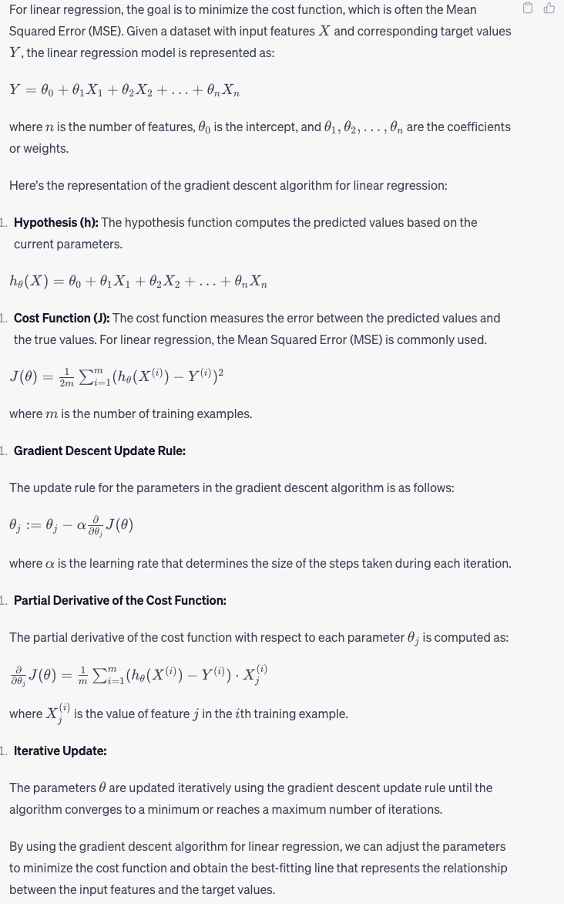

# Regression
## Linear Regression
Linear regression is a statistical method used for modeling the relationship between a dependent variable (target) and one or more independent variables (predictors or features) by fitting a linear equation to the observed data. The primary goal of linear regression is to find the best-fitting linear relationship between the variables, which can be used for making predictions or understanding the strength and direction of the relationship.

There are two main types of linear regression:
1. Simple Linear Regression:
   * Simple linear regression models the relationship between a single independent variable (X) and a dependent variable (Y).
   * The relationship is represented by a straight line equation: Y = aX + b, where "a" is the slope (coefficient) of the line, and "b" is the y-intercept (the point where the line intersects the y-axis).
   * The goal is to find the values of "a" and "b" that minimize the sum of the squared differences between the predicted values and the actual values of Y.

2. Multiple Linear Regression:
   * Multiple linear regression extends the concept to more than one independent variable.
   * The relationship is represented by the equation: Y = a₁X₁ + a₂X₂ + ... + aₙXₙ + b, where "a₁," "a₂," etc., are the coefficients for the respective independent variables, and "b" is the y-intercept.
   * The goal is to find the values of "a₁," "a₂," etc., and "b" that minimize the sum of the squared differences between the predicted values and the actual values of Y.

Key concepts and terms related to linear regression include:
* Residuals: Residuals are the differences between the observed values (actual data points) and the predicted values (values predicted by the linear regression model). Minimizing the sum of squared residuals is a common method for finding the best-fitting line.
* Coefficient of Determination (R²): R² is a statistical measure that quantifies the proportion of the variance in the dependent variable that can be explained by the independent variables in the regression model. It ranges from 0 to 1, with higher values indicating a better fit.

Linear regression is widely used in various fields, including economics, finance, social sciences, and machine learning, for tasks such as:

* Predicting future values based on historical data.
* Analyzing the relationships between variables and understanding their impact.
* Identifying trends and making forecasts.
* Evaluating the effectiveness of marketing campaigns and strategies.
* Building simple baseline models in machine learning for regression problems.

Linear regression is a fundamental technique that provides insights into the linear relationships between variables and serves as a building block for more complex regression and predictive modeling methods.

## Cost function
A cost function, also known as a loss function or objective function, is a fundamental concept in various machine learning algorithms, especially in supervised learning tasks like regression and classification. It is a mathematical function that measures how well a machine learning model's predictions align with the actual (observed) data. The goal of a cost function is to quantify the error or the difference between the predicted values and the true values (or labels).

The specific form of the cost function depends on the type of machine learning task:

### Regression:
* In regression problems, the goal is to predict a continuous numerical value (e.g., predicting house prices, stock prices, or temperature).
* The common cost function for regression is Mean Squared Error (MSE) or Root Mean Squared Error (RMSE), which calculates the average of the squared differences between the predicted values and the true values.

### Classification:
* In classification problems, the goal is to assign data points to predefined categories or classes (e.g., spam vs. non-spam emails, identifying objects in images).
* Common cost functions for classification include:
  * Binary Cross-Entropy (log loss): Used for binary classification tasks, where there are two classes.
  * Categorical Cross-Entropy: Used for multiclass classification tasks, where there are more than two classes.
  * Hinge Loss: Commonly used in Support Vector Machines for binary classification.

## Mathematical representation of the cost function
The mathematical representation of the cost function can vary depending on the specific machine learning task (e.g., regression, classification) and the choice of the cost function. Here are some common mathematical representations for the cost functions in regression and classification:

###  Mean Squared Error (MSE) - Regression:
* Task: Predicting a continuous numerical value.
* Cost Function: MSE measures the average of the squared differences between the predicted values (ŷ) and the true values (y).
* Mathematical Representation:
  MSE(ŷ, y) = (1/n) * Σ(yᵢ - ŷᵢ)² for i from 1 to n

### Binary Cross-Entropy (Log Loss) - Binary Classification:
* Task: Binary classification (two classes: 0 and 1).
* Cost Function: Binary cross-entropy measures the dissimilarity between the true binary labels (y) and the predicted probabilities (p).
* Mathematical Representation:
  Binary Cross-Entropy(p, y) = - Σ[yᵢ * log(pᵢ) + (1 - yᵢ) * log(1 - pᵢ)] for i from 1 to n

### Categorical Cross-Entropy - Multiclass Classification:
* Task: Multiclass classification (more than two classes).
* Cost Function: Categorical cross-entropy measures the dissimilarity between the true class labels (y) and the predicted class probabilities (p) for multiple classes.
* Mathematical Representation:
  Categorical Cross-Entropy(p, y) = - Σ Σ[yᵢj * log(pᵢj)] for i from 1 to n, j from 1 to m

Where:
* n is the number of samples.
* m is the number of classes.
* yᵢj is a binary indicator (0 or 1) of whether class j is the correct classification for sample i.
* pᵢj is the predicted probability that sample i belongs to class j.

### Hinge Loss - Support Vector Machines (SVM):
* Task: Binary classification (two classes: -1 and 1) with support vector machines.
* Cost Function: Hinge loss measures the loss associated with the margin of separation between data points and the decision boundary.
* Mathematical Representation:
  Hinge Loss(p, y) = Σ[max(0, 1 - yᵢ * pᵢ)] for i from 1 to n

Where:
* n is the number of samples.
* yᵢ is the true class label (-1 or 1) for sample i.
* pᵢ is the decision function output for sample i.
  
The choice of the cost function depends on the specific machine learning problem and the algorithm used. The goal is to minimize the cost function by adjusting the model's parameters during the training process, leading to better predictions and improved model performance.

---
## Gradient descent
Gradient descent is an optimization algorithm used to minimize a function by iteratively moving in the direction of the steepest descent as defined by the negative of the gradient. It is commonly used in machine learning and deep learning for finding the local minimum of a differentiable function. Gradient descent is used to update the parameters of a model in order to minimize the cost function or the error between the predicted values and the actual values.

Here's how gradient descent works:
* Initialization: The algorithm starts by initializing the model's parameters (weights and biases) with some random values.
* Compute the Gradient: The gradient is a vector of partial derivatives that indicates the rate of change of the function with respect to each parameter. In the context of machine learning, it represents the direction of the steepest increase of the cost function.
* Update the Parameters: The parameters are updated in the opposite direction of the gradient to minimize the cost function. The update rule is defined by the learning rate, which determines the size of the steps taken in the direction of the gradient. The learning rate is a hyperparameter that needs to be carefully tuned, as a small value may lead to slow convergence, while a large value may cause the algorithm to overshoot the minimum.
* Iterate: Steps 2 and 3 are repeated iteratively until the algorithm converges to a minimum. Convergence is achieved when the change in the parameters or the cost function falls below a predefined threshold or when a maximum number of iterations is reached.

There are different variants of gradient descent, including:
* Batch Gradient Descent: Computes the gradient using the entire dataset at each iteration, which can be computationally expensive for large datasets.
* Stochastic Gradient Descent (SGD): Computes the gradient using a single data point at each iteration, leading to noisy updates but faster convergence.
* Mini-Batch Gradient Descent: Computes the gradient using a subset of the data (a mini-batch) at each iteration, combining the advantages of both batch gradient descent and stochastic gradient descent.

Gradient descent is a fundamental optimization algorithm that underpins the training process of many machine learning models, including linear regression, logistic regression, neural networks, and other models. It is essential for updating the model's parameters to improve its performance and make accurate predictions on new data.

The mathematical representation of the gradient descent algorithm involves the calculation of the gradient, the update of the parameters, and the iterative process to minimize the cost function. Here's the general mathematical representation of the gradient descent algorithm:
* Cost Function (J): The cost function measures the error between the predicted values and the true values. It is a function of the model's parameters (weights and biases).
* Gradient (∇J): The gradient of the cost function is a vector of partial derivatives with respect to each parameter. It represents the direction of the steepest increase of the cost function.
* Parameters (θ): The parameters of the model, including weights (w) and biases (b).
* Learning Rate (α): The learning rate determines the size of the steps taken in the direction of the gradient during each iteration.

The general steps of the gradient descent algorithm can be represented as follows:
* Initialization: Initialize the parameters θ with random values.
* Compute the Gradient:
  Compute the gradient (∇J) of the cost function J with respect to the parameters θ.
* Update the Parameters:
  Update the parameters using the gradient and the learning rate:
    θ := θ - α * ∇J
  This step moves the parameters in the opposite direction of the gradient to minimize the cost function.
* Iterate:
Repeat steps 2 and 3 until the algorithm converges to a minimum, as determined by a predefined threshold or a maximum number of iterations.

## Gradient descent for linear regression

## Learning rate
The learning rate is a hyperparameter in the gradient descent algorithm that controls the step size or the rate at which the parameters are updated during each iteration. It determines how quickly or slowly the algorithm learns and converges to the optimal solution. Setting the appropriate learning rate is crucial for the convergence and performance of the algorithm.

Here's what you need to know about the learning rate in the context of gradient descent:
### Effect on Convergence:
* If the learning rate is too small, the algorithm may take a long time to converge, requiring a large number of iterations to reach the minimum.
* If the learning rate is too large, the algorithm may overshoot the minimum, causing it to oscillate or diverge.

### Tuning the Learning Rate:
* The learning rate is a hyperparameter that needs to be tuned during the training process to find the optimal value.
* It often requires experimentation and testing with different values to observe the effects on the convergence and performance of the algorithm.

### Learning Rate Schedules:
* Learning rate schedules, such as step decay, exponential decay, or adaptive learning rates, can be used to adjust the learning rate during training.
* These schedules help to gradually decrease the learning rate over time, allowing for faster convergence during the initial iterations and finer adjustments as the algorithm approaches the minimum.

### Adaptive Learning Algorithms:
* Adaptive optimization algorithms, such as AdaGrad, RMSprop, and Adam, adjust the learning rate dynamically based on the gradients of the parameters.
* These algorithms can automatically adapt the learning rate for each parameter, improving the convergence and performance of the optimization process.

Choosing the appropriate learning rate is essential for achieving faster convergence and better performance in the gradient descent algorithm. It is an important factor to consider when training machine learning models, and finding the right balance can significantly impact the training process and the quality of the learned model.

